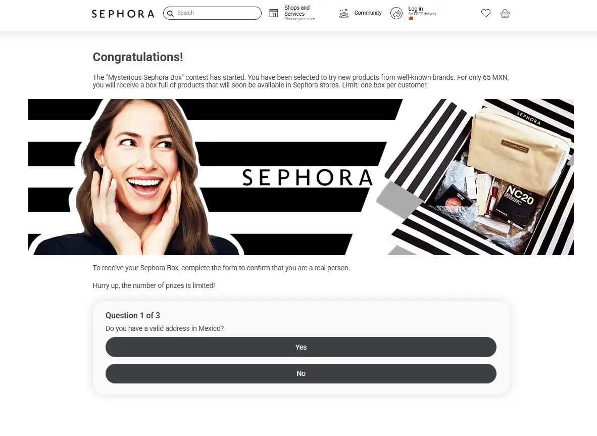
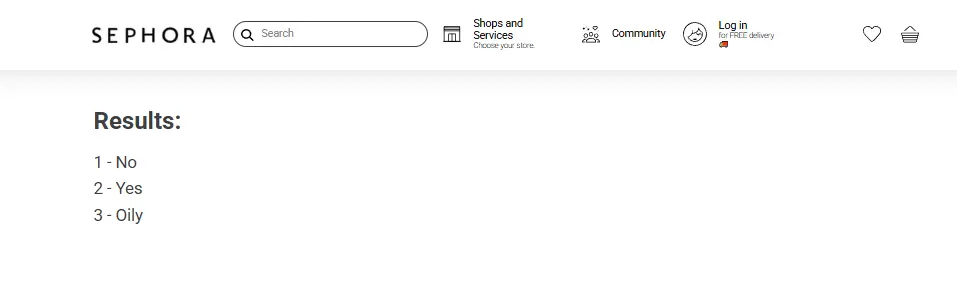

# Responsive Survey Page in React


A responsive single-page survey application built with **React**, **Context API**, and **useReducer**. The app allows users to go through a set of questions, and once completed, displays a summary of the responses instead of the original content.

## Features


- Responsive layoutOptimized for mobile and desktop using media queries.
- Survey blockUsers can answer a series of predefined questions with a simple UI.
- Results renderingAfter the last question, the survey block is replaced with a clean result summary.
- Smooth UIIncludes hover effects and subtle CSS animations for a polished user experience.

## State management


Uses React Context to toggle between survey and result views.

Uses useReducer to manage user responses efficiently.

## Stack


- React

- TypeScript

- CSS

- React Context API

- useReducer

## Screenshots






## Development


1. Clone the repository:
```
git clone https://github.com/Oksana-2024/sephora.git
cd sephora
```
2. Install dependencies and start the development server:
```
npm install
npm run dev
```
3. Open http://localhost:5173 in your browser.

## Production


1. Install dependencies and build for production:
```
npm install
npm run build
```
2. Preview the production build:
```
npm run preview
```
3. Open http://localhost:4173 in your browser.

## Developer


developed by Oksana S. - Frontend Developer

